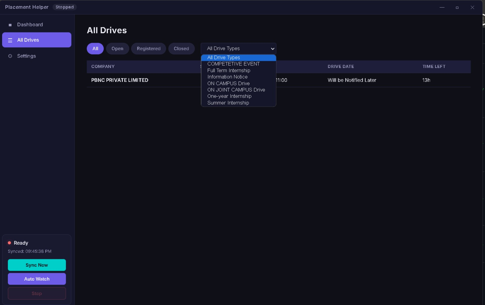

# Placement Helper

**LPU Placement Drive Dashboard & Pipeline** — An Electron app for LPU placement students to monitor and track placement drives automatically.

---

## Overview

Placement Helper automates the process of checking LPU's placement portal for new drives, internships, and job opportunities. It logs in to the UMS portal, fetches available drives, registers for them, and presents everything in a clean desktop dashboard.

The app is built in **Electron** and consists of:

- **Dashboard UI** — `dashboard/` — Electron main process, renderer, preload script, and HTML/CSS UI
- **Pipeline engine** — `pipeline.js` — Fetches drives from LPU's UMS portal, scrapes company listings, handles login sessions and postbacks
- **Analytics** — `analytics.js` — Optional PostHog analytics (key via env var)
- **Build system** — `build.js` + `obfuscate.js` — Obfuscates source and builds a Windows `.exe` via electron-builder

---

## Features

- **Dashboard** — Clean Electron desktop UI showing placement drive status
- **Pipeline automation** — Fetches placement drives from LPU UMS portal
- **Session management** — Maintains login sessions for the UMS portal
- **Drive registration** — Register for placement drives from the app
- **Obfuscation** — Source code obfuscation before distribution (via javascript-obfuscator)
- **Auto-update** — Electron-updater support for app updates
- **Analytics** — Optional PostHog telemetry (disabled by default, key via env var)

---

## Project Structure

```
placement-helper/
├── package.json              # Root package — build + pack scripts
├── package-lock.json
├── .gitignore
├── electron-builder.json     # Electron-builder config (NSIS installer, x64)
├── build.js                  # Build orchestrator — clean, obfuscate, install deps, build
├── obfuscate.js              # Source obfuscation via javascript-obfuscator
├── analytics.js              # PostHog analytics (key via POSTHOG_API_KEY env var)
├── pipeline.js               # LPU UMS placement drive fetcher + registration
├── pf.html                   # Landing/profile page
└── dashboard/
    ├── package.json          # Electron app manifest
    ├── package-lock.json
    ├── main.js               # Electron main process
    ├── preload.js           # Context bridge API
    ├── renderer.js           # Renderer process logic
    ├── index.html           # Dashboard UI
    ├── styles.css           # Dashboard styles
    └── start.bat            # Windows startup helper
```

---

## Screenshots

### All Drives Page



The "All Drives" page showing upcoming placement drives with time remaining, drive type filters, and status tabs (All / Open / Registered / Closed). Drives like PBNC PRIVATE LIMITED show hours remaining and notify when the drive date is set.

---

## Dependencies

| Package | Purpose |
|---------|---------|
| `electron` ^28 | Desktop app framework |
| `electron-builder` ^25 | Windows `.exe` packaging (NSIS installer) |
| `javascript-obfuscator` ^4 | Source code obfuscation before release |
| `axios` ^1.9 | HTTP requests to LPU UMS portal |
| `cheerio` ^1 | HTML parsing for drive listings |
| `dotenv` ^16 | Environment variable loading |
| `electron-updater` ^6 | Auto-update support |
| `posthog-node` ^4 | Optional analytics (key via env) |

---

## Pipeline (`pipeline.js`)

The pipeline is the core engine. It connects to LPU's UMS placement portal at `https://ums.lpu.in/Placements/` and:

1. **Logs in** — Uses a session cookie to authenticate with the UMS portal
2. **Fetches drives** — `fetchDrivesPage()` — GETs the HomePlacementStudent.aspx page
3. **Parses listings** — Uses Cheerio to extract company names, deadlines, job profiles, statuses
4. **Handles postbacks** — `fetchTab()` — Posts back to navigate between tabs (internship, short-term, other, regular, placement)
5. **Fetches all tabs** — `fetchAllTabsDrives()` — iterates all drive categories
6. **Registers** — `registerDrive()` — Registers for a selected drive

The pipeline works with a session cookie passed in via `PIPELINE_DATA_DIR` (default: Electron's `userData` path). Drives are saved locally as JSON files for the dashboard to display.

**Note:** The pipeline targets `https://ums.lpu.in/Placements/`, LPU's public placement UMS. Only use this against your own LPU account with your own credentials.

---

## Dashboard (`dashboard/`)

The Electron app's UI layer.

### `main.js` — Main process

- Creates the BrowserWindow with the dashboard UI
- Manages the system tray
- IPC handlers for data, config, pipeline control, drive registration, portal open
- Loads `analytics.js` as a hidden background service
- Auto-updater integration via `electron-updater`

### `preload.js` — Context bridge

Exposes a safe API to the renderer:

```
api.getDrives()              → drives.json
api.getNewDrives()           → new_drives.json
api.getSorted()              → sorted_companies.json
api.getKnown()               → known_drives.json
api.getMyDrivesFull()        → my_drives_full.json
api.loadConfig() / saveConfig()
api.runPipeline(mode)        → start pipeline
api.stopPipeline()
api.registerDrive(name)
api.openPortal(url)
api.getStatus() / onStarted / onStopped / onLog / onRefresh
```

### `renderer.js` — Renderer process

- Renders the dashboard UI
- Handles user interactions
- Polls for pipeline status
- Displays drives, company listings, deadlines

### `index.html` — UI

Dashboard layout with sidebar navigation (Dashboard, Drives), status badge, and main content area.

---

## Build System

### `obfuscate.js`

Copies source files to `build-src/`, then obfuscates all JS using `javascript-obfuscator` with maximum protection. Non-JS files (HTML, CSS, JSON) are copied as-is.

Files obfuscated:
- `pipeline.js`
- `analytics.js`
- `dashboard/main.js`
- `dashboard/preload.js`
- `dashboard/renderer.js`

### `build.js`

Full build orchestrator:

1. Cleans `dist/` and `build-src/`
2. Runs obfuscation → `build-src/`
3. Installs production dependencies in `build-src/` and `build-src/dashboard/`
4. Runs `electron-builder` → Windows x64 NSIS installer in `dist/`
5. Verifies output

### Electron-builder config (`electron-builder.json`)

- App ID: `com.placement.helper`
- Product name: `Placement Helper`
- Target: Windows x64, NSIS installer
- ASAR packaging enabled
- Icons from `dashboard/icon.ico` (installer + uninstaller)

---

## Setup

### Prerequisites

- **Node.js** (v18+ recommended)
- **npm**
- **Windows** (for electron-builder NSIS target)
- **LPU UMS account** — to use the pipeline against your own placement portal

### Install

```bash
# Install root + dashboard dependencies
npm install
npm install --prefix dashboard

# Or use the convenience script
npm run install-all
```

### Run in development

```bash
# Start the Electron dashboard
npm start

# Or with dev flag
npm run dev --prefix dashboard
```

### Build for distribution

```bash
# Full production build (obfuscate + package)
npm run build

# Or step by step
node obfuscate.js          # obfuscate source to build-src/
npm run dist               # build NSIS installer to dist/
```

The installer lands in `dist/` as `Placement Helper Setup x.x.x.exe`.

---

## Configuration

### Environment variables

| Variable | Purpose | Default |
|----------|---------|---------|
| `POSTHOG_API_KEY` | PostHog project API key for analytics | None (analytics disabled) |
| `PIPELINE_DATA_DIR` | Directory for session files, drives JSON, cookies | Electron `userData` path |

### `.env` file

Create a `.env` in the pipeline data directory (Electron `userData`):

```
POSTHOG_API_KEY=your_posthog_project_api_key_here
```

Without `POSTHOG_API_KEY`, analytics is a no-op. The placeholder `'YOUR_POSTHOG_API_KEY_HERE'` is used in code — replace with your key or set the env var.

---

## Usage

### Start the dashboard

```bash
npm start
```

The dashboard opens with the placement drive overview. Use the sidebar to switch between views.

### Run the pipeline

From the dashboard, click **Run Pipeline** or trigger via IPC from the renderer. The pipeline:
1. Connects to LPU UMS using the stored session
2. Fetches all available drives across categories
3. Saves results to JSON files in the data directory
4. Updates the dashboard

### Register for a drive

Select a drive in the dashboard and click **Register** — the pipeline posts the registration to the UMS portal.

---

## Security Notes

### PostHog API key

The PostHog key is read from `process.env.POSTHOG_API_KEY`. The code contains only a placeholder `'YOUR_POSTHOG_API_KEY_HERE'`. **Do not commit a real key.** Set it via environment variable before running the app.

### LPU UMS session

The pipeline uses a session cookie to authenticate. This cookie is stored locally in the pipeline data directory. Treat it like a password — don't share it, and clear it when done.

### Only use against your own account

The pipeline targets LPU's public placement UMS. Only run it with your own LPU credentials and account. Do not use it to access other students' data.

### Obfuscation

The build pipeline obfuscates source before distribution. However, obfuscation is not a security boundary — a determined reverse engineer can still recover logic. Use it to raise the effort barrier, not as a guarantee.

---

## Scripts

| Script | Purpose |
|--------|---------|
| `npm start` | Start the Electron dashboard |
| `npm run dev` | Start with dev flag |
| `npm run obfuscate` | Run obfuscation only |
| `npm run build` | Full build (obfuscate + package) |
| `npm run pack` | Build Windows x64 installer to dist/ (dir only) |
| `npm run dist` | Build Windows x64 NSIS installer |
| `npm run clean` | Remove dist/ and build-src/ |

---

## License

MIT License — see [LICENSE](LICENSE) for details.

---

## Author

Pawan Yadav ([@Pawan947](https://github.com/Pawan947))
